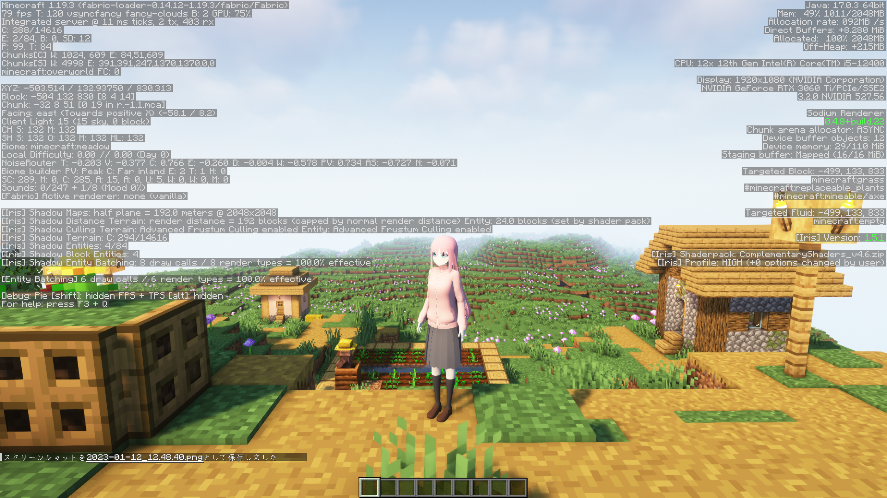
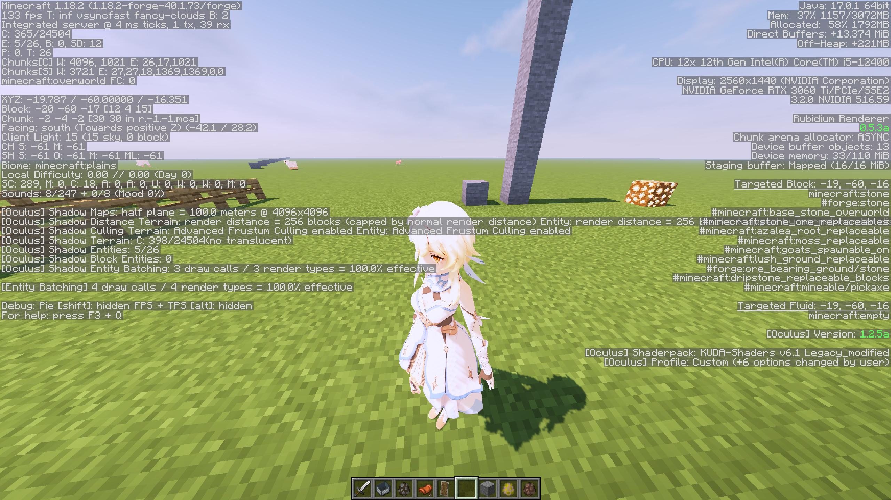
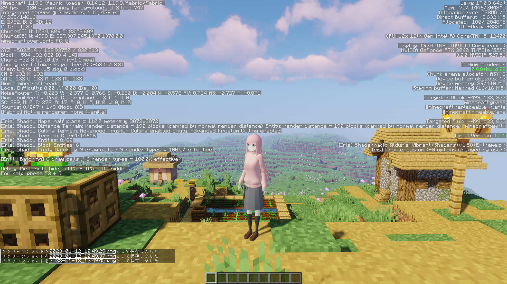

# for Canary

### ほぼメモのようなもの。

工夫次第で影が描画可能です。ただし、かなり不安定なので環境によってはできないかもしれません。  

* OptifineではなくRubidiumとOculusを使う。  
* 使いたいシェーダーを解凍、編集する必要あり。  
* MMDShaderを使用している場合はおそらく正常に描画されない。  
* シェーダーを使用中にモデルを再読み込みすると表示が崩れることがよくある。  
  * その際は使用するプログラムの変更をするキー(初期設定ではテンキーの3)を押すことでMMDShaderに切り替えてから戻してみる。  
  * プレイヤー以外のエンティティが停止中、歩行中などに表示がおかしいときは、表示がおかしくなっている時にMMDShaderに切り替えてから素早く戻すと治ることがある。  
* シェーダーの中で編集する必要のあるファイルはgbuffers_entitiesまたはshadowという名前がついたファイルを見ると分かる。  

現在再配布中、かつ描画がある程度の品質以上のシェーダーは以下の通り。  

* Whipped-Cream([modified](https://github.com/Gengorou-C/Whipped-Cream))([Original](https://github.com/Zi7ar21/Whipped-Cream))
* Solas Shader([modified](https://github.com/Gengorou-C/Solas-Shader))([Original](https://github.com/Septonious/Solas-Shader))
* Super-Duper-Vanilla([modified](https://github.com/Gengorou-C/Super-Duper-Vanilla))([Original](https://github.com/Eldeston/Super-Duper-Vanilla))

## Image

* BSL Shaders(再配布不可)

* Complementary Shaders(再配布不可)

* Continuum Shaders(再配布不可)

* KUDA Shaders(再配布不可)

* SEUS Renewed(再配布不可)

* Sildur's Vibrant shaders(再配布不可)

* Solas Shader

* Super-Duper-Vanilla

* Whipped-Cream

## さいごに

本当なら私自身でシェーダーの講座を書き、シェーダーの編集方法を広められれば良いのですが、自分の理解度が全く足りず、できませんでした。  
編集済みのシェーダーが他のシェーダーを編集する際の手助けになれば幸いです。  
ライセンス違反がありましたら是非お知らせください。
 
 
P.S.  
「配布されているシェーダーをKAIMyEntity向けに改変するソフトを作成して配布」は「あらゆる形での再配布」に含まれるのだろうか…
