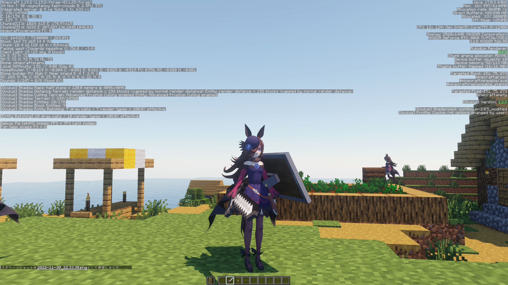
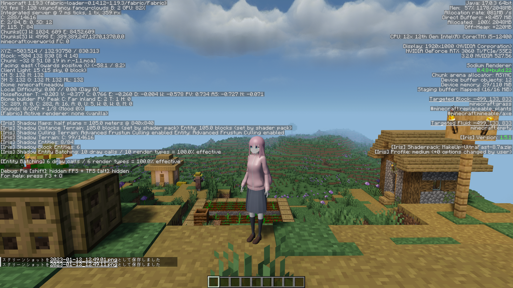
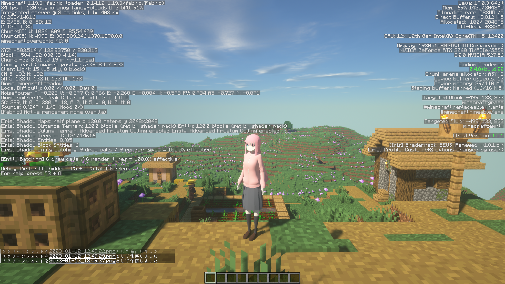
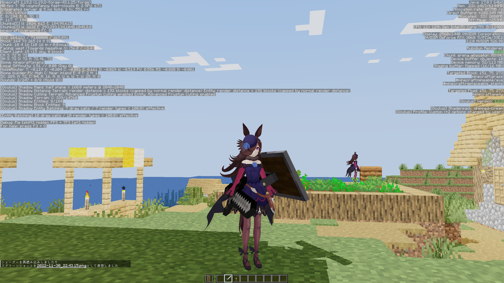

# Shader

## 初めに

工夫次第で影が描画可能です。ただし、かなり不安定なので環境によってはできないかもしれません。  

* OptifineではなくRubidium+OculusまたはSodium+Irisを使う。  
* 使いたいシェーダーを解凍、編集する必要あり。  
* MMDShaderを使用している場合はおそらく影が正常に描画されない。  
* モデルが正常に描画されない場合、

  * インベントリを開く。
  * シェーダーを一度無効化して、そのまま有効化する。(Kキー)
  * プログラムを一度MMDShaderに切り替えて、そのままもう一度切り替えて元に戻す。(テンキーの0)  

  上記の操作のいずれかを行うと正常に戻ることがあります。
* シェーダーの中で編集する必要のあるファイルはgbuffers_entitiesまたはshadowという名前がついたファイルを見ると推測できることが多い。  

## 編集済みのシェーダー

現在再配布中のシェーダーは以下の通り。  

* (Forgeのみ？)Whipped-Cream([modified](https://github.com/Gengorou-C/Whipped-Cream))([Original](https://github.com/Zi7ar21/Whipped-Cream))
* Solas Shader([modified](https://github.com/Gengorou-C/Solas-Shader))([Original](https://github.com/Septonious/Solas-Shader))
* Super-Duper-Vanilla([modified](https://github.com/Gengorou-C/Super-Duper-Vanilla))([Original](https://github.com/Eldeston/Super-Duper-Vanilla))
* MakeUpUltraFast-legacy([modified](https://github.com/Gengorou-C/MakeUpUltraFast/tree/legacy))([Original](https://github.com/javiergcim/MakeUpUltraFast/tree/legacy)))

## Image

* BSL Shaders(再配布不可)

* Continuum Shaders(再配布不可)

* MakeUpUltraFast-legacy

* SEUS Renewed(再配布不可)

* Solas Shader

* Super-Duper-Vanilla

* Whipped-Cream

## さいごに

本当なら私自身がシェーダーの講座を書き、シェーダーの編集方法を広められれば良いのですが、私の理解度が全く足りず、できませんでした。  
編集済みのシェーダーが他のシェーダーを編集する際の手助けになれば幸いです。  
ライセンス違反等がありましたら是非お知らせください。
 
 
P.S.  
「配布されているシェーダーをKAIMyEntity向けに改変するソフトを作成して配布」は「あらゆる形での再配布」に含まれるのだろうか…
