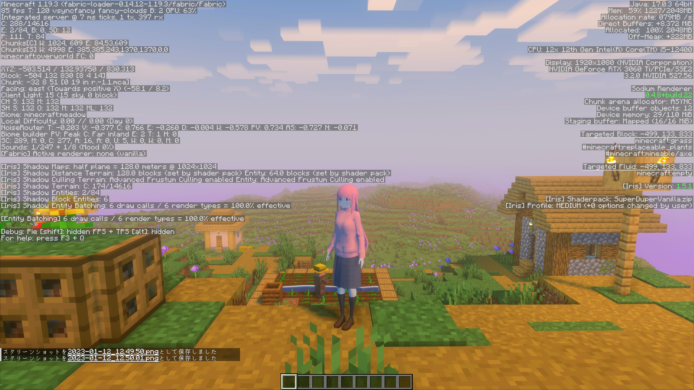
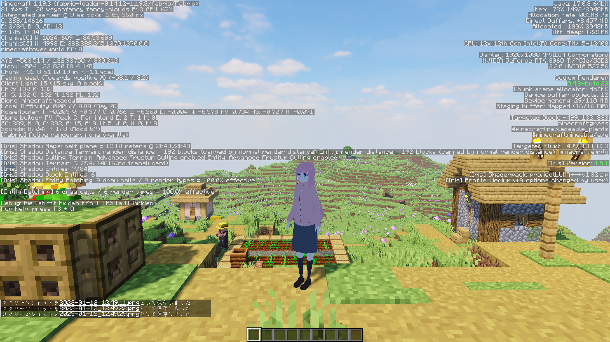

# Shader

## 初めに

不安定なので環境によってはできないかもしれません。  

* Optifineではなく、Rubidium+OculusまたはSodium+Irisを使う。  
* 使いたいシェーダーを解凍、編集する必要がある場合があります。  
* MMDShaderを使用している場合はおそらく影が正常に描画されない。  
* モデルが正常に描画されない場合、

  * インベントリを開く。
  * シェーダーを一度無効化して、そのまま有効化する。(Kキー)
  * プログラムを一度MMDShaderに切り替えて、そのままもう一度切り替えて元に戻す。(テンキーの0)  

  上記の操作のいずれかを行うと正常に戻ることがあります。
* シェーダーの中で編集する必要のあるファイルはgbuffers_entitiesまたはshadowという名前がついたファイルを見ると推測できることが多い。  

## Image

使用3Dモデル：[ぼっちちゃん(のがみな氏)](https://3d.nicovideo.jp/works/td85893)  
以下のスクショで使われているシェーダーは編集していないシェーダーです。

* [BSL Shaders(Garrison Cahyadi氏)](https://bitslablab.com/bslshaders/)

* [Continuum Shaders(Continuum Graphics)](https://continuum.graphics)

* [MakeUpUltraFast](https://www.curseforge.com/minecraft/customization/makeup-ultra-fast-shader)

* [SEUS Renewed(Cody Darr氏)](https://www.sonicether.com/seus/)

* [Solas Shader](https://www.curseforge.com/minecraft/customization/solas-shader)

* [Super Duper Vanilla](https://www.curseforge.com/minecraft/customization/super-duper-vanilla-shaders)

### 上手く描画されない例

* [projectLUMA](https://www.curseforge.com/minecraft/customization/projectluma)

## さいごに

Ver.20230110以前のModの為に編集したシェーダーのリンクを置いておきます。

* Solas Shader([modified](https://github.com/Gengorou-C/Solas-Shader))([Original](https://github.com/Septonious/Solas-Shader))
* Super-Duper-Vanilla([modified](https://github.com/Gengorou-C/Super-Duper-Vanilla))([Original](https://github.com/Eldeston/Super-Duper-Vanilla))
* MakeUpUltraFast-legacy([modified](https://github.com/Gengorou-C/MakeUpUltraFast/tree/legacy))([Original](https://github.com/javiergcim/MakeUpUltraFast/tree/legacy)))  

編集済みのシェーダーが他のシェーダーを編集する際の手助けになれば幸いです。  
ライセンス違反等がありましたら是非お知らせください。
 
 
P.S.  
「配布されているシェーダーをKAIMyEntity向けに改変するソフトを作成して配布」は「あらゆる形での再配布」に含まれるのだろうか…
